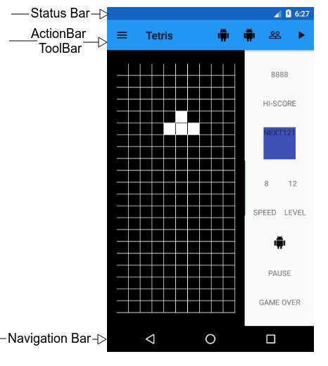

## 0x00、 隐藏 state bar

[原文](https://developer.android.com/training/system-ui/status)

关于 Android 的许多 bar 暂时留白



本节介绍在不同版本的 Android 系统下如何隐藏 status bar 。
隐藏 status bar (或者 navigation bar),让我们的内容有更多的展示控件，以此给用户提供更 immersive(*百度说*[沉浸式用户体验](https://fanyi.baidu.com/#en/zh/providing%20a%20more%20immersive%20user%20experience) | *Google 说* [身临其境的用户体验](https://translate.google.cn/#view=home&op=translate&sl=en&tl=zh-CN&text=providing%20a%20more%20immersive%20user%20experience)) 的体验。

|Figure 1|Figure 2|
|--------|--------|
|status bar 可见|status bar 隐藏。注意 action bar 也被隐藏。当不显示 status bar 的时候你也不应该显示 action abr|
|||

## 0x01、 在 Android 4.0 (API 14) 和更低版本隐藏 Status Bar

你可以 API≤14 的版本上通过设置 WindowManager flag 隐藏 status bar 。
你能以编程的方式做到这一点，也能通过在 manifest 文件设置 activity theme 做到这一点。
如果你的 app 应该始终保持隐藏 status bar，在 manifest 文件设置 activity theme 是更常用的途径(准确的说你应该继承如下主题)：

```xml
<application
    ...
    android:theme="@android:style/Theme.Holo.NoActionBar.Fullscreen" >
    ...
</application>
```

使用 activity theme 的优势如下：
1. 设置更简便，不易出错。
2. 更平滑的 UI 转换，因为，系统在实例化你的 main activity 之前就已经知道了这个 app 的样式。

或者，你通过设置 WindowManager flag 的方式。
当用户和你的 app 交互时，这可以轻松隐藏 status bar 。

```java
public class MainActivity extends Activity {

    @Override
    protected void onCreate(Bundle savedInstanceState) {
        super.onCreate(savedInstanceState);
        // If the Android version is lower than Jellybean, use this call to hide
        // the status bar.
        if (Build.VERSION.SDK_INT < 16) {
            getWindow().setFlags(WindowManager.LayoutParams.FLAG_FULLSCREEN,
                    WindowManager.LayoutParams.FLAG_FULLSCREEN);
        }
        setContentView(R.layout.activity_main);
    }
    ...
}
```

当你设置了 WindowManager flag(不论是 java 还是 xml 方式)，除非你清除这些 flag 否则它们会对你的 app 产生持续的影响。

你能使用 `FLAG_LAYOUT_IN_SCREEN` 去设置你的 activity 布局使用相同的屏幕区域，当你打开 `FLAG_FULLSCREEN` 的时候，它是可用的。
防止当 status bar 是否隐藏的状态发生变化的时候调整你的布局内容。

## 0x03、 在 Android 4.1 (API 16) 和更高版本隐藏 Status Bar

在 API≥16 的时候，你可以使用 `setSystemUiVisibility()` 设置 status 的显示状态。
`setSystemUiVisibility()` 在 view 级别设置 UI 标志，这些设置会汇总到 window 级别。
使用 `setSystemUiVisibility()` 设置 UI flags 相对于 WindowManager flags 来说你能更细粒度的控制 System bar。示例代码：

```java
View decorView = getWindow().getDecorView();
// Hide the status bar.
int uiOptions = View.SYSTEM_UI_FLAG_FULLSCREEN;
decorView.setSystemUiVisibility(uiOptions);
// Remember that you should never show the action bar if the
// status bar is hidden, so hide that too if necessary.
ActionBar actionBar = getActionBar();
actionBar.hide();
```

需要注意：
1.  一旦 UI flag 被清理(例如通过导航按钮关闭 activity )，如果你希望再次隐藏 bar 你需要在此设置。
    [UI 可见性变化的响应](https://developer.android.com/training/system-ui/visibility.html)一文中讨论了如何监听 UI 可见性的变化从而你的 app 能监听并响应它们。
2.  设置 UI flag 的位置不同有不同的结果。
    如果你的 system bar 隐藏代码写在 activity 的 `onCrate()` 函数，当用户点击 home 键，system bar 会再次出现.
    当用户重新打开 activity ，`onCreate()` 不会被重新调用了所以 system bar 将保持可见。
    如果你希望 system bar 持续保持不可见状态，你应该在  `onResume()` 或者 `onWindowFocusChanged()` 设置 UI flags 。
3.  `setSystemUiVisibility()` 函数仅在调用它的视图可见时有效。
4.  从可见 View 离开之后， `setSystemUiVisibility()` 设置的 flag 将会被清除。

## 0x04、 使内容出现在 status bar 后面

在 Android 4.1 (API ≥ 16) 和更高版本，你能设置你应用的内容出现在 status bar 之后，从而做到当 status bar 的显示状态变化时试图内容不会重新调整。
要做到这一点，使用 `SYSTEM_UI_FLAG_LAYOUT_FULLSCREEN` 。
你可能也会用到 `SYSTEM_UI_FLAG_LAYOUT_STABLE` 保持布局状态。

当你使用这个功能的时候保证你应用的关键部分(例如地图应用中的内置控件)不被 system bar 覆盖就变成了你自己的责任。
这一点可能使你的 app 不可用。
在多数情况下你可以通过在 XML 布局文件中设置 `android:fitsSystemWindows="true"` 对这种情况做出处理。
仅需要调整父布局(ViewGroup)与 system window 的距离。
这对多数应用来说就足够了。

在一些情况下，你甚至需要修改默认的 padding 才能使你的应用有预期效果。
直接相对于 system bar (它占据了一个被称为窗口“内容插入(content insets)”的空间)对你的布局做出操作 复写 `fitSystemWindows(Rect insets)` 。
当一个 window 的“插入内容(content insets)”发生变化的时候 `fitSystemWindows(Rect insets)` 会被视图层调用，从而允许 window 对内容做出适当的调整。
通过复写这个方法你能操作这个 insets (以及应用程序的布局)。