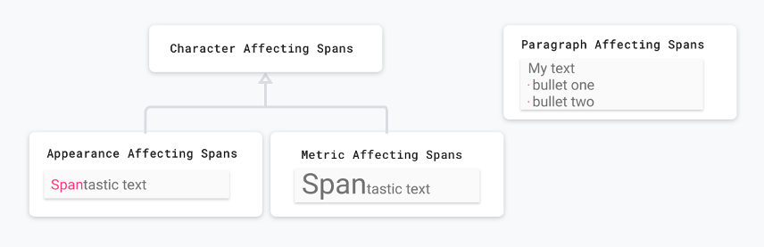

## 0x00、 [Span](https://developer.android.com/guide/topics/text/spans#java)
span 是一个高效的表对对象。你能在字符或者段落中应用它。
通过为 Text 附加一个 span 对象，你能改变 text 多个方面，包括颜色，标记文字是否可点击，缩放文字尺寸，或者通过自定义的方式绘制文字。
Span 能改变 TextPaint 属性，在 canvas 上绘制，甚至改变文字布局。

Android 提供了多种文字样式参数以供使用。
你也可以定制自己的 span 风格。

## 0x01、 创建并应用一个 span

你可以使用下表中的任何一个类创建一个 span 。
每一个类有不同点体现在三个方面：文本是否可变、文本标记是否可变、文本数据结构。

|类|文本是否可变|文本标记是否可变|数据结构|
|-|-|-|-|
|SpannedString|	No|	No|	Linear array|
|SpannableString|	No|	Yes|	Linear array|
|SpannableStringBuilder|	Yes|	Yes|	Interval tree|

关于选择那个类的一些可参考的点：

- 如果你的 文本和 文本标记子创建之后就不会变动，使用 SpannedString 。
- 如果你要对少量的文本附加标记并且文本是只读的，使用 SpanableString 。
- 如果你需要在 text 创建完成后对其进行修改，以及你需要附加更多的 span 到 text 上，使用 SpanableStringBuilder 。
- 如果你需要针对大量的 text 附加 span 对象，不论文字是否只读的，使用 SpannableStringBuilder 。

所有类都继承 Spaned 接口。
SpannableString 和 SpannagleStringBuilder 也继承了 Spannable 接口。

要应用一个 span 调用 Spnable 对象的 `setSpan(Object _what_, int _start_, int _end_, int _flags_)` 。
参数 `what` 是要应用到 text 上的 span 的引用，`start \ end`参数 指明那些文本将会应哟呢哦过 `what` 所引用的 span 。

当应用一个 span 后，如果你在应用了 span 的 text 中插入文本，span 会自动应用到新插入的文本上。
当在边界插入文本时(在 start 或 end 位置)，使用 `Spannable.SPAN_EXCLUSIVE_INCLUSIVE` 去包含插入的文本，或者用 `Spannable.SPAN_EXCLUSIVE_EXCLUSIVE` 排除插入的文本。

下面的历史展示了如何将 `ForegroundColorSpan` 附加到字符串上。
```java
SpannableStringBuilder spannable = new SpannableStringBuilder("Text is spantastic!");
spannable.setSpan(
    new ForegroundColorSpan(Color.RED),
    8, // start
    12, // end
    Spannable.SPAN_EXCLUSIVE_INCLUSIVE
);
```


上图是使用了 ForegroundColorSpan 的效果。

因为设置了 Spannable.SPAN_EXCLUSIVE_INCLUSIVE ，span 的效果能扩展到插入进来的文本：

```java
SpannableStringBuilder spannable = new SpannableStringBuilder("Text is spantastic!");
spannable.setSpan(
    new ForegroundColorSpan(Color.RED),
    8, // start
    12, // end
    Spannable.SPAN_EXCLUSIVE_INCLUSIVE
);
spannable.insert(12, "(& fon)");
```


上图是在对设置了 `Spannable.SPAN_EXCLUSIVE_INCLUSIVE` 进行文本插入的效果。

你可以在同一个文本上附加多个效果：
```java
SpannableString spannable = SpannableString(“Text is spantastic!”);
spannable.setSpan(
    new ForegroundColorSpan(Color.RED),
    8, 12,
    Spannable.SPAN_EXCLUSIVE_EXCLUSIVE
);
spannable.setSpan(
    new StyleSpan(BOLD),
    8, spannable.length,
    Spannable.SPAN_EXCLUSIVE_EXCLUSIVE
);
```


上图设置了两个效果 ：`ForegroundColorSpan(Color.RED) 和 StyleSpan(BOLD)`

## 0x02、 Android span 类型

Android 提供了超过 20 种 span (在 android.text.style 包内)。
Android 对 span 进行分类主要通过两种方式：

- span 如何影响文字：span 能影响文字的外观和尺寸。
- Span 范围：一些 span 能被应用到单个字符，另一些必须应用到整段文字。



上图将的是 span类别：字符 VS 段落，外观 VS 尺寸。
下面一节是类别的细节。

下文： **略**